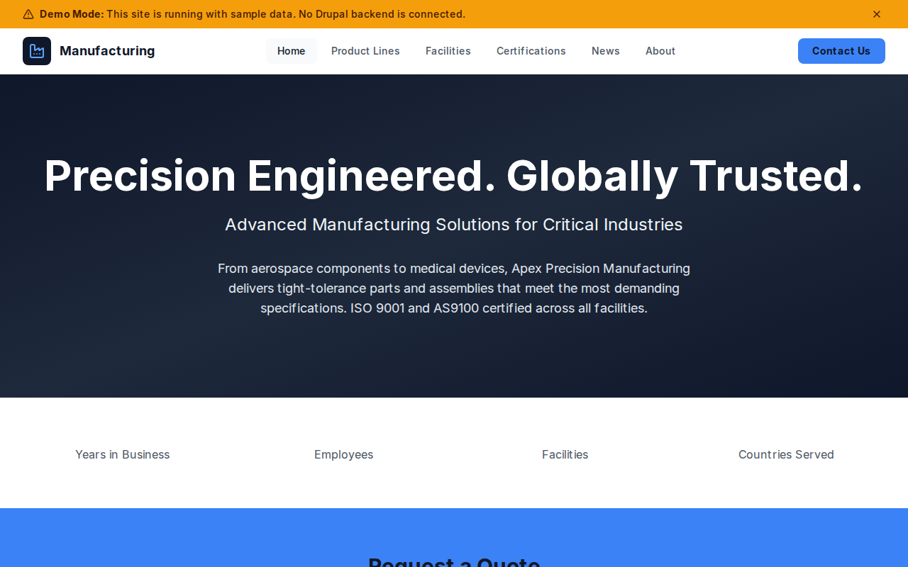

# Decoupled Manufacturing

A precision manufacturing company website starter template for Decoupled Drupal + Next.js. Built for manufacturers, fabrication shops, industrial suppliers, and engineering firms that need to showcase product lines, facilities, certifications, and company news.



## Features

- **Product Lines** - Showcase manufacturing capabilities with applications, materials, lead times, and minimum orders
- **Facility Profiles** - Highlight plant locations with square footage, employee counts, capabilities, and equipment details
- **Certifications** - Display quality certifications (ISO 9001, AS9100, ITAR) with issuing bodies and scope
- **Company News** - Press releases, sustainability reports, and industry updates with tags and author info
- **Homepage** - Hero section with company statistics, featured product lines, and quote request CTA
- **Static Pages** - About, careers, and other informational pages
- **Modern Design** - Clean, professional UI optimized for industrial and B2B content

## Quick Start

### 1. Clone the template

```bash
npx degit nextagencyio/decoupled-manufacturing my-manufacturing
cd my-manufacturing
npm install
```

### 2. Run interactive setup

```bash
npm run setup
```

This interactive script will:
- Authenticate with Decoupled.io (opens browser)
- Create a new Drupal space
- Wait for provisioning (~90 seconds)
- Configure your `.env.local` file
- Import sample content

### 3. Start development

```bash
npm run dev
```

Visit [http://localhost:3000](http://localhost:3000)

---

## Manual Setup

If you prefer to run each step manually:

<details>
<summary>Click to expand manual setup steps</summary>

### Authenticate with Decoupled.io

```bash
npx decoupled-cli@latest auth login
```

### Create a Drupal space

```bash
npx decoupled-cli@latest spaces create "My Manufacturing Site"
```

Note the space ID returned (e.g., `Space ID: 1234`). Wait ~90 seconds for provisioning.

### Configure environment

```bash
npx decoupled-cli@latest spaces env 1234 --write .env.local
```

### Import content

```bash
npm run setup-content
```

This imports:
- Homepage with hero image, statistics, and CTAs
- 3 Product Lines (Precision Machined Components, Sheet Metal Fabrication, Castings & Forgings)
- 3 Facilities (Dayton HQ, Phoenix Fabrication, Houston Casting)
- 3 Certifications (ISO 9001, AS9100, ITAR)
- 3 News Articles (expansion, sustainability, apprenticeship)
- 2 Static Pages (About, Careers)

</details>

## Content Types

### Product Line
- Title, Body (detailed description)
- Product Image
- Applications (list), Materials (list)
- Lead Time, Minimum Order
- Industry (taxonomy: Aerospace, Automotive, Defense, etc.)

### Facility
- Title, Body (equipment and details)
- Facility Image
- Location, Square Footage, Employees
- Capabilities (list)
- Year Established

### Certification
- Title, Body (scope description)
- Certification Image
- Issuing Body, Certificate Number
- Valid Through, Scope

### News
- Title, Body (article content)
- Featured Image
- Author Name
- Tags (taxonomy: press-release, award, expansion, etc.)

### Homepage
- Hero Title, Subtitle, Description, Hero Image
- Statistics (paragraph items with number and label)
- Featured Items Title
- CTA Title, Description, Primary and Secondary buttons

## Customization

### Colors & Branding
Edit `tailwind.config.js` to customize colors, fonts, and spacing.

### Content Structure
Modify `data/manufacturing-content.json` to add or change content types and sample content.

### Components
React components are in `app/components/`. Update them to match your design needs.

## Demo Mode

Demo mode allows you to showcase the application without connecting to a Drupal backend. It displays mock content for the homepage, product lines, facilities, certifications, and news.

### Enable Demo Mode

Set the environment variable:

```bash
NEXT_PUBLIC_DEMO_MODE=true
```

Or add to `.env.local`:
```
NEXT_PUBLIC_DEMO_MODE=true
```

### What Demo Mode Does

- Shows a "Demo Mode" banner at the top of the page
- Returns mock data for all GraphQL queries
- Displays sample product lines, facilities, certifications, and news
- No Drupal backend required

### Removing Demo Mode

To convert to a production app with real data:

1. Delete `lib/demo-mode.ts`
2. Delete `data/mock/` directory
3. Delete `app/components/DemoModeBanner.tsx`
4. Remove `DemoModeBanner` from `app/layout.tsx`
5. Remove demo mode checks from `app/api/graphql/route.ts`

## Deployment

### Vercel (Recommended)
[](https://vercel.com/new/clone?repository-url=https://github.com/nextagencyio/decoupled-manufacturing)

Set `NEXT_PUBLIC_DEMO_MODE=true` in Vercel environment variables for a demo deployment.

### Other Platforms
Works with any Node.js hosting platform that supports Next.js.

## Documentation

- [Decoupled.io Docs](https://www.decoupled.io/docs)
- [Next.js Documentation](https://nextjs.org/docs)
- [Drupal GraphQL](https://www.decoupled.io/docs/graphql)

## License

MIT
